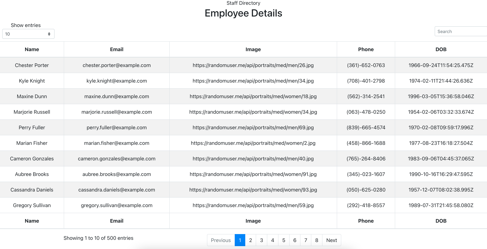

# Week-19---React
Employee Directory 

## Description 

In this app the intention is to be able to sort Employee data by typical data types and sort those types by a specific category.  The user can also search by names and the returned responses are filtered by the user input.  This app uses a random user api to return info, however it could be adapted to be used with other information data bases.  

## Images 

## Technologies Used 

* React 
* Random User API
* Create React App 
* MDBReact npm package 
* Axios
* Github pages 

## Links 

* [GitHub Repo](https://github.com/rffrye/Week-19---React)
* [Deployed APP](https://rffrye.github.io/Week-19---React/)